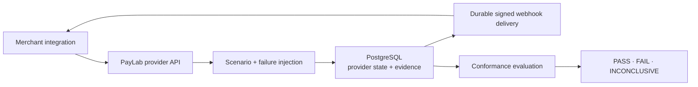

# PayLab

[](https://github.com/Sye-1321/PayLab/actions/workflows/ci.yml)
[](LICENSE)

PayLab is a provider-neutral payment resilience lab that deliberately creates the failure conditions
most payment sandboxes avoid: ambiguous outcomes, unsafe retries, concurrent duplicate requests,
duplicated or reordered webhooks, callback failures, and invalid signatures.

It acts as a fictional payment provider, records observable evidence at the provider boundary, and
evaluates only claims that evidence can prove. Supported evaluations produce `PASS`, `FAIL`, or
`INCONCLUSIVE`. PayLab is not a real gateway, PSP, Stripe clone, production payment processor,
certification authority, or generic chaos-testing framework.

> What does the backend do when the payment may have succeeded, but the network does not give it a
> clean answer?

Java 25 · Spring Boot · PostgreSQL · Flyway · Testcontainers



## What PayLab proves

| Area | What PayLab exercises |
| --- | --- |
| Ambiguous outcomes | A payment commits but its HTTP response becomes uncertain |
| Idempotency | Same-key replay and conflicting key reuse |
| Concurrency | Real PostgreSQL-backed duplicate-create races |
| Webhooks | Signed delivery, duplicates, retries, stale ordering, and invalid signatures |
| Durability | Persisted provider state, events, webhook work, attempts, and leases |
| Evidence | Observable requests, resolutions, status queries, and webhook delivery |
| Conformance | Evidence-backed `PASS`, `FAIL`, or `INCONCLUSIVE` where observable evidence is sufficient |
| CI output | Immutable finalized results exportable as JUnit XML |

PayLab establishes provider-side behavior and facts visible at the provider boundary. It does not
claim exactly-once delivery, merchant database correctness, merchant-side deduplication, or correct
merchant-internal state transitions.

## Scenarios

| Scenario | What it exercises |
| --- | --- |
| `ASYNC_SUCCESS` | Normal asynchronous payment flow |
| `TIMEOUT_BEFORE_COMMIT` | Transport failure before provider execution |
| `TIMEOUT_AFTER_COMMIT` | Ambiguous outcome after provider execution |
| `SAME_KEY_RETRY` | Idempotent replay |
| `KEY_REUSE_DIFFERENT_PAYLOAD` | Conflicting reuse of an idempotency key |
| `DUPLICATE_WEBHOOK` | At-least-once callback delivery |
| `OUT_OF_ORDER_WEBHOOK` | Stale event delivered after a newer event |
| `WEBHOOK_RETRY` | Callback failure followed by retry |
| `INVALID_SIGNATURE` | Rejection of untrusted callback evidence |
| `CONCURRENT_DUPLICATE_CREATE` | Idempotency under a real request race |

Detailed contracts are in [`docs/scenarios.md`](docs/scenarios.md).

## Evidence boundary

PayLab observes the system from the provider boundary. It can directly observe merchant-to-provider
requests, idempotency keys, request fingerprints, retries, provider payment resolution, status
queries, provider-to-merchant webhook attempts, and webhook response status and timing.

It cannot automatically prove whether the merchant deduplicated a webhook internally, verified a
signature before processing, performed an internal database transition exactly once, ignored a
stale event internally, or fulfilled downstream work once. PayLab issues a conformance verdict only
when the available evidence supports one. Missing evidence does not become a pass.

## Conformance

The current automatic evaluators are:

| Scenario | Invariant | Evaluated behavior |
| --- | --- | --- |
| `TIMEOUT_AFTER_COMMIT` | `INV-01` | Recovery from an ambiguous committed payment |
| `SAME_KEY_RETRY` | `INV-02` | Equivalent same-key replay resolves to one payment |
| `KEY_REUSE_DIFFERENT_PAYLOAD` | `INV-03` | Different intent does not reuse an existing key |

These scenarios have defined conformance assertions that can be evaluated from the evidence PayLab
currently observes. The remaining scenarios still execute fully and produce evidence, but automatic
verdicts are limited to behaviors the current evidence model can establish. PayLab does not infer
merchant-internal correctness from provider-side observations.

- `PASS` means sufficient evidence establishes the required behavior.
- `FAIL` means sufficient evidence establishes a violation.
- `INCONCLUSIVE` means the available evidence is insufficient.

See [`docs/invariants.md`](docs/invariants.md) and
[`docs/conformance.md`](docs/conformance.md) for the rules and evidence model.

## V1 scope

The current V1 scope contains:

- 10 payment resilience scenarios, including a normal asynchronous baseline;
- provider-side request and event evidence;
- PostgreSQL-backed idempotency and concurrency behavior;
- durable signed webhook delivery, retries, duplicate delivery, and stale event ordering;
- three evidence-backed conformance evaluators with `PASS`, `FAIL`, and `INCONCLUSIVE` semantics;
- run finalization with immutable persisted conformance snapshots;
- JSON conformance retrieval and JUnit XML export for finalized runs;
- a local PostgreSQL quickstart and automated CI against the existing test suite.

V1 does not provide real payment processing or provider compatibility, merchant-side
instrumentation or internal-state certification, regulatory or PCI certification, production
deployment infrastructure, a user interface, or generic chaos testing.

## Getting started

Prerequisites: Java 25 and Docker with Docker Compose. Maven does not need to be installed because
the repository includes the Maven Wrapper. The Compose configuration is for local development only.

1. Start PostgreSQL:

   ```bash
   docker compose up -d
   ```

   This starts PostgreSQL 18.4 on `localhost:5432` with database, username, and password all set to
   `paylab` as local development defaults.

2. Set an example local-only webhook signing secret in the shell that will start PayLab. Do not use
   this example value in a shared or production environment.

   PowerShell:

   ```powershell
   $env:PAYLAB_WEBHOOK_SIGNING_SECRET="local-dev-only-secret"
   ```

   Bash/zsh:

   ```bash
   export PAYLAB_WEBHOOK_SIGNING_SECRET="local-dev-only-secret"
   ```

3. Start PayLab.

   Windows:

   ```powershell
   .\mvnw.cmd spring-boot:run
   ```

   macOS/Linux:

   ```bash
   ./mvnw spring-boot:run
   ```

   The application is available at `http://localhost:8080`.

4. Create a test run to confirm the application is working:

   ```bash
   curl -X POST http://localhost:8080/test-runs \
     -H "Content-Type: application/json" \
     -d '{"scenario":"SAME_KEY_RETRY"}'
   ```

   A successful response returns a `runId`.

| Environment variable | Purpose | Default |
| --- | --- | --- |
| `SPRING_DATASOURCE_URL` | PostgreSQL JDBC URL | `jdbc:postgresql://localhost:5432/paylab` |
| `SPRING_DATASOURCE_USERNAME` | PostgreSQL username | `paylab` |
| `SPRING_DATASOURCE_PASSWORD` | PostgreSQL password | `paylab` |
| `PAYLAB_WEBHOOK_SIGNING_SECRET` | Webhook HMAC signing secret | required |

Stop PostgreSQL while preserving its data with `docker compose down`. To remove the named volume
and start with a fresh local database, run `docker compose down -v`.

## Architecture

PayLab is one modular Java/Spring Boot service. PostgreSQL is the authority for payments, run
evidence, idempotency, and durable webhook work; Flyway manages its schema and Spring JDBC provides
data access. Scenario executors inject faults without changing the provider model's core safety
boundaries, and merchant systems remain external systems under test.

See [`docs/architecture.md`](docs/architecture.md) for transaction, persistence, concurrency, and
delivery details.

## Webhook contract

Webhook scenarios require a callback URL when creating the test run. PayLab delivers the exact
persisted JSON body with `Content-Type: application/json` and these headers:

- `PayLab-Event-Id`: stable provider event UUID;
- `PayLab-Timestamp`: Unix epoch seconds for the delivery attempt;
- `PayLab-Signature`: lowercase hexadecimal HMAC-SHA256 of the UTF-8 timestamp, a literal `.`, and
  the exact raw request body.

The signing key must be supplied as `paylab.webhook.signing-secret` (environment variable
`PAYLAB_WEBHOOK_SIGNING_SECRET`); there is no default. Delivery work and attempts are durable in
PostgreSQL. See [`docs/scenarios.md`](docs/scenarios.md) for delivery behavior and
[`docs/security.md`](docs/security.md) for trust boundaries.

## Finalization and reporting

- `GET /test-runs/{runId}/conformance` evaluates an open supported run from its current evidence.
- `POST /test-runs/{runId}/finalize` persists the current `PASS`, `FAIL`, or `INCONCLUSIVE` result as
  an immutable conformance snapshot.
- `GET /test-runs/{runId}/report/junit.xml` exports the frozen result of a finalized run as JUnit XML.

Finalized results are not reevaluated from later evidence. Unsupported scenarios remain executable
but cannot be finalized, because they do not have automatic conformance evaluators.

## Safety and scope

PayLab is for development and test environments and does not process real money. Real cardholder
data, real payment credentials, and real customer funds are outside its scope. It does not provide
regulatory certification, PCI compliance, or production-provider compatibility.

## Documentation

- [`docs/invariants.md`](docs/invariants.md) — payment-safety rules
- [`docs/scenarios.md`](docs/scenarios.md) — detailed scenario contracts
- [`docs/conformance.md`](docs/conformance.md) — evidence and verdict semantics
- [`docs/architecture.md`](docs/architecture.md) — current system structure
- [`docs/security.md`](docs/security.md) — security model and trust boundaries
- [`docs/adr/`](docs/adr/) — durable architectural decisions

## License

PayLab is licensed under the [Apache License 2.0](LICENSE).
